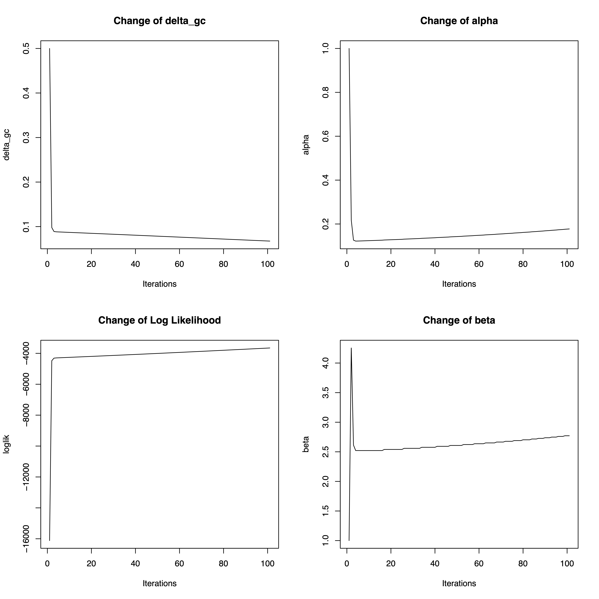

Tutorial of ZIBB test on Dysplasia and Barrett's Esaphugus example
========================================
Jiazhen Rong, Rodrigo A. Gier, University of Pennsylvania


In this tutorial, we will go over how the Zero-inflated Beta-Binomial (ZIBB) test is performed on the mitochondrial variants of interest and identify significant carriers of the variant, and therefore help with identifying cell lineages. Within a biopsy collected from a patient with high-grade dysplasia, we observed two large clusters of epithelial cells by scRNA-seq. The example data of Barrett's esophagus can be downloaded in Dropbox [here](https://www.dropbox.com/scl/fo/n8bsompncgsj1zwpprtnf/h?rlkey=k32wmueoqv6yzvgfrwcumovd4&dl=0). Please download the data to be in the same folder as our package.

### Step 1: Load example data
In this step, we want to load data required for the ZIBB test:

 - A mitochondrial alternate allele variant count matrix **X** (variant x cell)
 - A mitochondrial total read count matrix **N** (variant x cell)
 - A Seurat object with standard processing, including UMAP and celltype annotations
 - Variants of Interest generated after filtering MAEGATK output
 - (Optional) Metadata of the variants if any further processings are needed
 
To be consistent with the model and for easy understanding, we renamed the variables to be same as our model.

```
library(scmtVT)
library(Matrix)
# Step 1. load example data
setwd("~/Documents/GitHub/scmtVT/") # set path to be your path of the package 
seu <- readRDS("../data/a191_be/a191_be_final.rds")  # seurat object containing scRNA-Seq result and cluster annotations
counts <- read.table("../data/a191_be/a191_be_mt_counts.csv", sep=",", header=T, row.names = 1) # total mito count matrix
af_mtx <- read.table("../data/a191_be/af_dm.csv",sep=",",header=T, row.names = 1) # mito alternate allele variant count matrix
vars_metadata <- read.table("../data/a191_be/191_be_allvariants.txt", sep="\t", header=T, row.names = 1) # metadata of the variants

# formatting data for ZIBB model 
N=as(as.matrix(counts[sapply(strsplit(rownames(af_mtx),"_"),"[[",1),]), "sparseMatrix") # total count coverage, variant x cell
rownames(N) <- rownames(af_mtx)
X =as(as.matrix(as.matrix(N)*af_mtx*0.01), "sparseMatrix")  # alternative allele count coverage, variant x cell
X = round(X)

# load cell labels and set background/normal cells
cell_label <- as.character(seu@active.ident)
cell_label[cell_label %in% c("FB","IM","VC")] = "Normal"
cell_label = as.factor(cell_label)

# load somatic variants of interest identified earlier
voi <- c("2692_G>A", "4037_G>A", "6360_G>A", "7074_G>A", "15153_G>A",
         "2813_T>C", "5055_T>C", "15305_T>C", "5215_T>C")

```

### Step 2: Running expectation maximization to infer model parameters

We model the background contaminations and signals as the following:

Let i be cell index 1, 2, ... , n. <br/>
Let j be variant index 1, 2, ..., m. <br/>
Let c be cell cluster $c_1,c_2, ... c_k$. <br/>

We assume the model as zero-inflated beta-binomial model: 


$$ X_{ij} \sim ~ (1-\delta_{g(c)})I\{X_{ij}=0\} + \delta_{g(c)} Binomial(N_{ij},p_{j0})$$

$$ p_{j0} \sim ~ Beta(\alpha,\beta) $$


Assuming we have a missing data telling where distribution $X_{ij}$ is from:

```math
$$ Z_{ij} =
\begin{cases}
      1, & \text{if}\ X_{ij} \sim Beta-Bin(X_{ij} | N_{ij},\alpha,\beta) \text{ , with prob } \delta_{g(c)}\\
      0, & \text{if}\ X_{ij} \sim I\{X_{ij}=0\} \text{ , with prob } 1-\delta_{g(c)}
    \end{cases}$$
```

Then from iterative expectation-maximization process, we can estimate the unknown parameters of the model (For the math details, please check our method part).

 - In **E-step**, $E[Z_{ij}|X_{ij},N_{ij}]$ is calculated for the missing variable.
 - In **M-step**, the parameters that maximizes complete data likelihood is estimated. 
 
And the process is achived via the **EM_ZIBB()** function. Usually we suggest ~100 iterations (setting *iterations=100*) for a stable performance. In real practice, if the running time is too long, ~ 10 iterations is acceptable.

```
gc = "Normal" # set background cluster name
X_sub = t(as.matrix(X[voi,cell_label == gc]))
N_sub = t(as.matrix(N[voi,cell_label == gc]))
# Expectation - Maximization to find the parameters from background/normal cells
set.seed(42)
param_fit=EM_ZIBB(X_sub,N_sub,alpha=1,beta=1,delta_gc=0.5,iterations=100,stop_diff=1e-05,gc="Normal",
                  save_path="example/output/zibb_fit/",verbose=T)
```

(Optionally) A diagnostic plot can be visualized from the EM process of the iterations. The result will be defaultly saved in **zibb_fit/** folder if no save path specified.
```
# (optional) create diagnostic plot
ZIBB_fit_diagnostic_plot(X_sub,N_sub,delta_gc=0.5,alpha=1,beta=1,delta_ij_hat=0.5,gc="Normal",
                                     delta_gc_list,LL_list,alpha_list,beta_list,save_path="example/output/zibb_fit/",
                                     width=10,height=10)
# visualize 
browseURL("example/output/zibb_fit/start_a_1_b_1_del_0.5_Normal.pdf")
```


### Step 3: Perform ZIBB statistical test for variants of interest

In step 2, **param_fit** stores all parameters estimated in each iteration. Now let's take the final iteration's parameter result as the model parameters.

Then, a corresponding statistical test designed for ZIBB is performed on each variant of interest, through **ZIBB_test()** function. 

From this step we can obtain the P-value/new test statistics $u_{ij}$ for cell $i$, variant $j$, seeing if they belong to the background distribution by chance:
$$\mu_{ij} = P(ZIBB(N_{ij},\hat \alpha_0, \hat \beta_0)\geq X_{ij}) = 1-CDF_{ZIBB|N_{ij},\hat\alpha_0,\hat\beta_0}(X_{ij})$$
$$= 1-\hat\delta_{g(c)\_{final}} CDF_{Beta-Bin}(X_{ij}|N_{ij},\hat \alpha_0, \hat \beta_0)$$

Or to be more variant specific to each variant :
$$\mu_{ij} = P(ZIB(N_{ij},\hat p_{j0})\geq X_{ij}) = 1-CDF_{ZIB|N_{ij},\hat p_{j0}}(X_{ij})$$
$$= 1-\hat\delta_{g(c)\_{final}} CDF_{Bin}(X_{ij}|N_{ij},\hat p_{j0})$$
And our test hypothesis is:
$$H_0: U_{ij} \sim Unif[0,1]$$
$$H_A: U_{ij} \text{ enriched around 0} $$

From this step, we can obtain the p-values of each cell $i$ under the background contamination test. The significant cells/carriers of a variant are those with small p-values($u_{ij}$) selected from FDR process, with a control of $FDR=0.1$. diagnostic plots, and the significant cells in UMAP will also be generated by setting `output=T,plot_umap=T`

```
# take parameter values from final iterations
alpha=alpha_list[length(alpha_list)]
beta=beta_list[length(beta_list)]
delta_gc=delta_gc_list[length(delta_gc_list)]
pval_df=ZIBB_test(X_sub,N_sub,alpha,beta,delta_ij_hat,gc="Normal",cell_label=cell_label,seu=seu,voi=voi,
                      output=T,plot_umap=T,save_path="example/output/zibb_fit/test_results/",verbose=F)

```

Here we demonstrate the example of 15153 G>A, which is a mitochondrial lineage mutation shared by Barrett's Esaphogus and the Dysplasia cells, and discssued in our Figure 4. It cam be seen that this lineage mutation exists in part of the Barrett's Esaphogus cells, and clonally expand to form the whole dysplasia cell cluster.

```
# visualize 
browseURL("example/output/zibb_fit/test_results/15153_G>A_significant_cells_UMAP.pdf")
```
A_significant_cells_UMAP.png" width="800">

The function also generates corresponding diagnostic plots, where
 - column 1: Alternative Allele Count vs Coverage
 - column 2: Alternative Allele Freuqnecy vs Coverage
 - column 3: Alternative Allele Freuqnecy vs Coverage in each cluster
 - column 4: Distributions of Alternative Allele Freuqnecy
 - column 5: Distributions of square root of Alternative Allele Freuqnecy
And the line representing fitted background signals for a given variant from the ZIBB model is also drawn.

A true variant is expected to have relative high variant allele frequency is high coveraage region, while background signals are usually within low coverage region.
```
browseURL("example/output/zibb_fit/test_results/15153_G>A_all_diagnostic_plot.pdf")
```

A_all_diagnostic_plot.png" width="1200">

### Step 4. Calculate expected value of coverage-specific false positives

In biological data, it is also found that a real null distribution is rarely uniformly distributed. Rather, an [emprical null distribution](https://www.jstor.org/stable/27590356) is preferred. Besides, a [separate class FDR analysis](https://projecteuclid.org/journals/annals-of-applied-statistics/volume-2/issue-1/Simultaneous-inference-When-should-hypothesis-testing-problems-be-combined/10.1214/07-AOAS141.full) was proposed to reduce overly conservative or overly liberal conclusions in multi-hypothesis testing. The class-wise FDR is estimated via binning the empirical null distribution and local FDR is estimated or each bin. Similarly, for a given variant, we propose a coverage-specific FDR analysis by binning the empirical null distribution for every 20 coverage counts, through **CoverageFP()** function. The expected number of false positives in each variant of interest will be saved as *sig_cell_number.txt* and *expected_false_positive_number.txt*.

```
FP_result = CoverageFP(save_path="example/output/zibb_fit/test_results/false_positives/",
                         X_sub,N_sub,alpha,beta,delta_ij_hat,bin_size = 20,voi,gc,FDR_alpha=0.1,cell_label,output=T)
# The total significant cell number from FDR process
View(FP_result$sig_cell_df) # significant cell number of each cluster 
```

||BE|DYSP|Normal|
|---|- | - | - |
|2692_G>A|26|0|0|
|4037_G>A|21|0|1|
|6360_G>A|155|8|2|
|7074_G>A|16|2|0|
|15153_G>A|29|1685|3|
|2813_T>C|125|3|2|
|5055_T>C|40|1|0|
|15305_T>C|12|0|0|
|5215_T>C|5|243|0|

And there are expected be false postives based on the emprically null distributions. 

For the 15153 G>A example, we see 3 significant cells in normal/background cluster; However, this does not mean the variant is significant, While the expected false postive number for 15153 G>A in the empirically null distributiosn is set as 3, the expected false postive number for 15153 G>A in BE cluster is 0.261 based on the coverage-specific estimation, while we actually observed 29 significant cells which is way more than 0.26. The expected false postive number for 15153 G>A in DYSP cluster is 0.57, while we actually observed 1685 significant cells. Overall the expected false postive number help to validate true mitochondrial lineage mutations.
```
View(FP_result$FP_df) # expected number false postives of each cluster 
```
||BE|DYSP|Normal|
|----|--|--|--|
|2692_G>A|0|0|0|
|4037_G>A|1.001|0.001|0.999800039992002|
|6360_G>A|11.0584228887635|1.002|1.99899959844274|
|7074_G>A|0|0|0|
|15153_G>A"|0.260869307441396|0.566204974105757|2.99999703557605|
|2813_T>C|1.54590683133802|0.2074418646532|1.99998035438569|
|5055_T>C|0|0|0|
|15305_T>C|0|0|0|
|5215_T>C|0|0|0|


